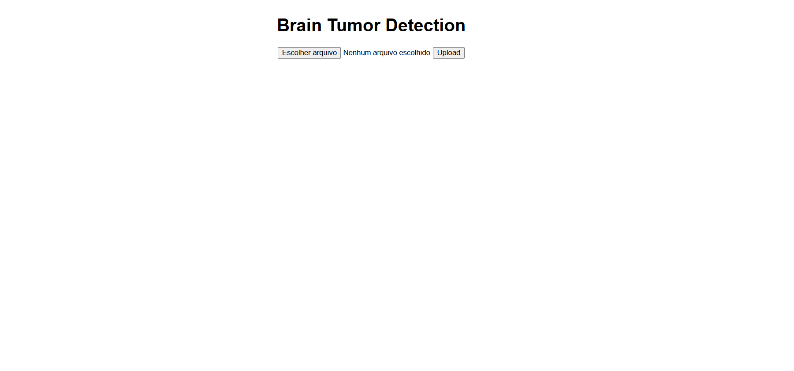
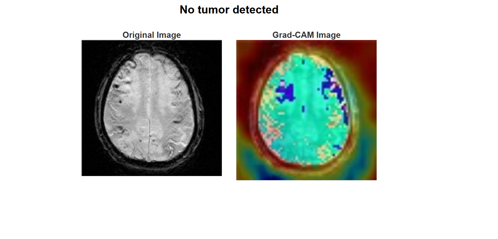

# brain_tumor_dectetor

A deep learning web application built with Flask for detecting brain tumors in medical images. This project uses a custom-trained convolutional neural network (CNN) for binary classification (tumor vs. no tumor), trained from scratch on a labeled medical image dataset.
The app integrates Grad-CAM visualizations to highlight important regions of the image that influenced the model’s prediction, providing transparency and interpretability in a clinical context.
Image preprocessing (resizing and normalization) is applied to ensure consistent model input. Users can upload their own medical images via a simple web interface and receive both a prediction and a Grad-CAM heatmap overlay.
 
 
The main goal of this project is to provide a tool that can classify images as tumor or non-tumor while offering interpretability for clinical use through visual explanations of the model’s decisions.
 
 
Technologies Used

Python – Programming language.

Flask – Web framework for serving the application.

TensorFlow / Keras – For building and training the CNN model.

NumPy – For numerical operations.

OpenCV / PIL – For image preprocessing.

Matplotlib – To generate Grad-CAM heatmaps.
 

